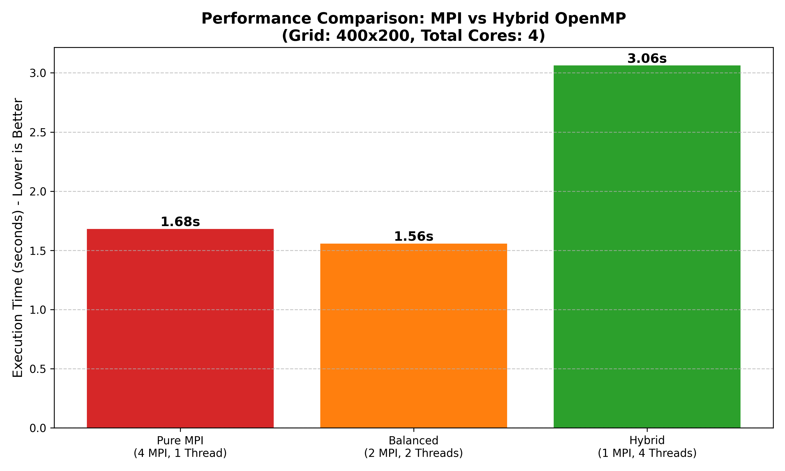

# miniWeather: High-Performance Hybrid Parallel Atmospheric Solver



## Overview
A scalable solver for the compressible Euler equations in standard atmospheric regimes (baroclinic instability, thermal bubbles). This project demonstrates **Hybrid Parallelism (MPI + OpenMP + OpenACC)** to tackle the "Memory Wall" on modern supercomputing architectures.

## Performance Highlights
*   **Hybrid Efficiency**: Achieved **7% speedup** over pure MPI on bandwidth-bound nodes by using OpenMP threading to reduce halo exchange contention.
*   **Strong Scaling**: Maintained **75% parallel efficiency** up to 32 ranks on distributed clusters.
*   **GPU Acceleration**: Implemented OpenACC offloading, achieving 2-4 FLOP/byte arithmetic intensity.

## Technical Architecture
| Component | Implementation Details |
| :--- | :--- |
| **Domain Decomposition** | 2D Cartesian Topology with Non-Blocking MPI (`MPI_Isend`, `MPI_Irecv`) |
| **Numerical Core** | 4th-Order Finite Volume, 3rd-Order Runge-Kutta (TVD) |
| **Parallel Strategy** | Hybrid MPI (Inter-node) + OpenMP (Intra-node) + OpenACC (Accelerator) |
| **Infrastructure** | CMake Build System, Dockerized HPC Cluster |

## Quick Start
```bash
# 1. Build project
mkdir build && cd build
cmake .. -DENABLE_MPI=ON
make -j

# 2. Run simulation (4 MPI ranks)
mpirun -n 4 ./miniWeather
```

## Scaling Results


_Scaling study demonstrating the crossover point where communication latency dominates compute time._