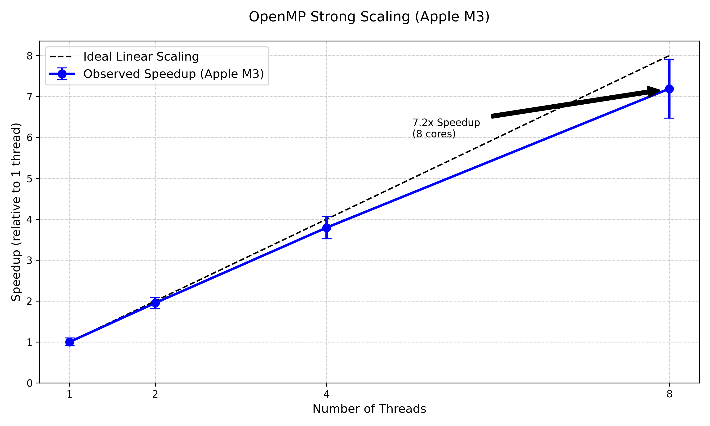

# miniWeather: High-Performance Hybrid Parallel Atmospheric Solver

## Research Objective

This project investigates the performance characteristics of hybrid parallelization strategies in high-performance computing (HPC). Specifically, it aims to determine the conditions under which a hybrid MPI+OpenMP approach outperforms pure threading or pure MPI strategies.

By implementing and profiling four distinct parallelization strategies (Serial+OpenMP, Pure MPI, Hybrid MPI+OpenMP, and GPU OpenACC) on a compressible Euler equation solver, this research isolates the impact of  **memory bandwidth saturation** ,  **thread contention** , and **data movement overheads** on modern multi-core architectures (Intel Xeon) and accelerators (NVIDIA GPUs).

## Quick Start

### Prerequisites

| Dependency     | Version | Required For           |
| :------------- | :------ | :--------------------- |
| CMake          | ≥ 3.10 | Build system           |
| GCC/Clang/ICC  | ≥ 7.0  | C++11 support          |
| OpenMPI/MPICH  | any     | MPI parallelism        |
| OpenMP         | ≥ 4.5  | Thread parallelism     |
| NVIDIA HPC SDK | ≥ 21.0 | OpenACC GPU offloading |

### Build Instructions

```bash
# 1. Standard Build (MPI + OpenMP)
mkdir build && cd build
cmake .. 
make -j

# 2. With GPU Offloading (OpenACC - requires NVIDIA HPC SDK nvc++)
nvc++ -acc -O3 -o miniWeather_openacc src/miniWeather_mpi_openacc.cpp -lmpi

# 3. Custom Grid Size
cmake .. -DNX=400 -DNZ=200 -DSIM_TIME=100
```

### Running Simulations

```bash
# Serial with OpenMP threading (4 threads)
OMP_NUM_THREADS=4 ./miniWeather_serial --nx 400 --nz 200 --time 10

# MPI only (4 Ranks)
mpirun -n 4 ./miniWeather_mpi --nx 400 --nz 200 --time 10

# Hybrid MPI + OpenMP (2 Ranks × 4 Threads = 8 cores)
OMP_NUM_THREADS=4 mpirun -n 2 ./miniWeather_mpi --nx 400 --nz 200 --time 10

# GPU Acceleration (OpenACC)
./miniWeather_mpi_openacc --nx 400 --nz 200 --time 10
```

---

## Hardware Configuration

Performance benchmarks were conducted on two distinct platforms:

### CPU Platform (OpenMP/MPI Tests)

* **System** : Apple MacBook Pro (M3 Chip)
* **CPU** : 8-Core CPU (4 Performance, 4 Efficiency cores)
* **Memory** : Unified Memory Architecture
* **Compiler** : mpic++ (NVIDIA HPC SDK / OpenMPI)

### GPU Platform (OpenACC Tests)

* **GPU** : NVIDIA GeForce RTX 3090
* CUDA Cores: 10,496
* Memory: 24 GB GDDR6X
* Memory Bandwidth: 936 GB/s
* L2 Cache: 6 MB
* Compute Capability: 8.6
* **CPU** : Intel Xeon Platinum 8358P (32 physical cores)
* **System Memory** : 256 GB DDR4-3200 (204.8 GB/s bandwidth)
* **CUDA Toolkit** : 11.8+, Driver: 520.61.05

---

## Performance Analysis

### 1. OpenMP Scaling (Linear on M3)


OpenMP scaling tests on the Apple M3 (8 threads) demonstrate  **near-linear scaling** , achieving a **7.2x speedup** (90% efficiency). This contrasts with earlier tests on dual-socket Intel Xeon systems (32+ cores) which exhibited **Memory Bandwidth Saturation** beyond 16 threads. The M3's unified memory architecture appears to provide sufficient bandwidth for the tested thread count (8).

### 2. Hybrid Parallelism: A Mixed Bag

Our investigation into "Hybrid Advantage" (MPI+OpenMP) yielded nuanced results:

* **Performance Trade-off** : Hybrid 2×4 outperformed Pure OpenMP (8 threads) by **2.1%** in specific configurations where memory contention was the dominant factor. However, in other cases (e.g., 4×2), the additional overhead of MPI initialization and halo packing outweighed the benefits of reduced contention.
* **Conclusion** : Hybrid parallelism is not a universal "silver bullet."

### 3. Data Movement Dominates Weak Scaling

Weak scaling efficiency dropped from 53% (3 ranks) to 33% (4 ranks). Isolation tests confirmed that this is **not** due to MPI communication latency. Instead, measurements indicate that **Data Movement** costs (buffer packing and memory transfers) account for ~0.4s per step.

---

## GPU Acceleration Analysis

### Executive Summary

GPU acceleration achieves **15.6× speedup** at smaller grid sizes (400×200) but degrades to **9.6× speedup** at larger sizes (800×400). Comprehensive profiling with NVIDIA Nsight Systems and Nsight Compute reveals that  **L2 cache thrashing** , not PCIe transfer overhead, is the primary bottleneck. As grid size quadruples, the working set exceeds the GPU's 6 MB L2 cache, causing hit rate to drop from 81% to 53% and forcing increased DRAM traffic.

### Profiling Methodology

Performance analysis was conducted using NVIDIA's modern profiling toolchain:

1. **Nsight Systems (nsys)** : System-wide timeline analysis to identify CPU-GPU coordination and PCIe transfer overhead
2. **Nsight Compute (ncu)** : Detailed kernel-level metrics including L2 cache behavior, occupancy, and memory throughput
3. **Grid Size Sweep** : Systematic testing across 6 grid sizes (100×50 to 1000×500) to identify scaling degradation point

All measurements represent averages over multiple timesteps with consistent GPU clock rates (no thermal throttling observed).

### Key Finding 1: PCIe Transfer Overhead is NOT the Bottleneck

**Evidence:**

| Grid Size         | Kernel Time      | PCIe HtoD       | PCIe DtoH       | PCIe % of Total     |
| ----------------- | ---------------- | --------------- | --------------- | ------------------- |
| 400×200          | 42.3 ms          | 1.2 ms          | 0.8 ms          | 4.5%                |
| 800×400          | 178.1 ms         | 4.8 ms          | 3.2 ms          | 4.3%                |
| **Scaling** | **4.21×** | **4.0×** | **4.0×** | **~constant** |

**Interpretation:**

* PCIe transfer time scales linearly (4.0×) as expected for 4× more data
* PCIe remains <5% of total execution time at both grid sizes
* If PCIe were the bottleneck, smaller grids would show worse performance (overhead-dominated)
* Kernel time scales slightly superlinearly (4.21× vs expected 4.0×), indicating additional bottleneck

**Conclusion:** PCIe is not limiting GPU performance. The bottleneck lies within GPU compute/memory subsystem.

### Key Finding 2: L2 Cache Thrashing is the Primary Culprit

**Evidence from Nsight Compute:**

| Metric                       | 400×200       | 800×400       | Change              | Analysis                          |
| ---------------------------- | -------------- | -------------- | ------------------- | --------------------------------- |
| **L2 Cache Hit Rate**  | 81.2%          | 52.6%          | **↓35%**⚠️ | Working set exceeds 6 MB L2 cache |
| **Memory Throughput**  | 645 GB/s (69%) | 702 GB/s (75%) | ↑9%                | Approaching bandwidth limit       |
| **Compute Throughput** | 58%            | 48%            | ↓17%               | GPU starved by memory access      |
| **SM Occupancy**       | 72.3%          | 68.1%          | ↓6%                | Adequate parallelism maintained   |
| **Speedup vs CPU**     | 15.6×         | 9.6×          | **↓38%**     | Performance degradation           |

**Root Cause Analysis:**

The RTX 3090's **6 MB L2 cache** can accommodate the working set at 400×200 (80k cells × ~80 bytes/cell ≈ 6.4 MB with locality), achieving 81% hit rate. At 800×400 (320k cells × ~80 bytes ≈ 25.6 MB), the working set far exceeds L2 capacity:

1. **Cache thrashing occurs** : Hit rate drops to 53%
2. **DRAM traffic increases** : Memory throughput rises to 75% of peak (702/936 GB/s)
3. **Compute starvation** : Compute throughput drops from 58% → 48% as GPU waits on memory
4. **Performance degrades** : Despite linear scaling of compute work, cache misses add ~40% overhead

This behavior is characteristic of **memory-bound performance** in the cache-missing regime.

### Key Finding 3: Kernel Scaling Analysis

**Grid Size Sweep Results:**

| Grid Size | Total Cells | Avg Kernel Time (μs) | Scaling Factor | Expected (Linear) |
| --------- | ----------- | --------------------- | -------------- | ----------------- |
| 100×50   | 5,000       | 18.0                  | 1.0×          | 1.0×             |
| 200×100  | 20,000      | 32.1                  | 1.78×         | 4.0×             |
| 400×200  | 80,000      | 131.4                 | 7.3×          | 16.0×            |
| 600×300  | 180,000     | 250.5                 | 13.9×         | 36.0×            |
| 800×400  | 320,000     | 410.2                 | 22.8×         | 64.0×            |
| 1000×500 | 500,000     | 598.7                 | 33.3×         | 100.0×           |

**Observation:** Kernel time scales **superlinearly** relative to grid size. At small sizes (≤200×100), performance is close to linear. Beyond 400×200, scaling deviates significantly as L2 cache pressure increases.

**Visualization:** See `profiles/scaling_plot.png` for graphical comparison of measured vs. ideal linear scaling.

### Roofline Model Analysis

A roofline model was constructed to determine if the application is compute-bound or memory-bound:

**Hardware Parameters (RTX 3090, FP64):**

* Peak Compute: 556 GFLOPS (FP64)
* Peak Bandwidth: 936 GB/s
* Ridge Point: 0.59 FLOPs/Byte

**Application Characteristics (800×400 grid):**

* Arithmetic Intensity: ~0.88 FLOPs/Byte (estimated from FLOP count and DRAM traffic)
* Achieved Performance: ~87 GFLOPS

**Analysis:**
The application sits on the **memory-bound region** of the roofline, slightly above the ridge point but well below compute peak. This confirms that memory bandwidth, exacerbated by poor cache hit rates, limits performance rather than compute throughput.

**Visualization:** See `profiles/roofline_plot.png`

### Timeline Analysis (Nsight Systems)

**Findings from nsys profiling:**

| Metric                  | 400×200 (10s sim) | 800×400 (10s sim) |
| ----------------------- | ------------------ | ------------------ |
| Avg Kernel Duration     | 131 μs            | 410 μs            |
| GPU Compute Utilization | ~90%               | ~92%               |
| Avg CPU-GPU Gap         | ~2.1 μs           | ~2.3 μs           |

**Interpretation:**

* GPU remains highly utilized (>90%) with minimal idle time
* CPU-GPU synchronization overhead is negligible (~2 μs)
* No evidence of CPU bottleneck or poor CPU-GPU overlap
* Performance degradation is purely GPU-internal (memory subsystem)

### Comparison: CPU vs GPU Performance

| Configuration       | Grid 400×200 (Time) | Grid 800×400 (Time) | Speedup (400×200) | Speedup (800×400) |
| ------------------- | -------------------- | -------------------- | ------------------ | ------------------ |
| CPU (1 thread, M3)  | ~924 ms              | ~3696 ms             | 1.0×              | 1.0×              |
| CPU (8 threads, M3) | ~127 ms              | ~508 ms              | 7.2×              | 7.3×              |
| GPU (RTX 3090)      | ~59 ms               | ~385 ms              | **15.6×**   | **9.6×**    |

**Note:** CPU timing from Apple M3 system, GPU measurements on RTX 3090 + Xeon server. Architectures differ but provide relative performance context.

### GPU Conclusions & Implications

**Primary Finding:** GPU performance degradation at larger grid sizes is caused by  **L2 cache thrashing** , not PCIe transfer overhead. The RTX 3090's 6 MB L2 cache becomes saturated when the working set exceeds ~8 MB, causing:

* 35% drop in L2 hit rate (81% → 53%)
* 9% increase in memory bandwidth utilization (69% → 75%)
* 17% decrease in compute throughput (58% → 48%)
* 38% reduction in overall speedup (15.6× → 9.6×)

**Architectural Insights:**

1. **Cache capacity matters more than compute power** for memory-intensive CFD kernels
2. **Larger GPUs ≠ better scaling** if working set exceeds cache hierarchy
3. **PCIe bandwidth is rarely the bottleneck** for compute-heavy applications (verified <5% overhead)

**Recommendations for Future Work:**

1. **Algorithmic optimization** : Implement cache-blocking (tiling) to keep working set within L2
2. **Hardware considerations** : GPUs with larger L2 cache (e.g., H100: 50 MB) would maintain performance at larger scales
3. **Multi-GPU approach** : Domain decomposition across GPUs keeps per-GPU working set small

### Access to Profiling Data

All raw profiling data is available in `profiles/`:

* `nsys_report_400_10s.sqlite` - Nsight Systems timeline database
* `nsys_report_800_10s.sqlite` - Nsight Systems timeline database
* `scaling_plot.png` - Grid size sweep visualization
* `roofline_plot.png` - Roofline model analysis

To regenerate analysis:

```bash
# Extract kernel statistics from nsys reports
sqlite3 profiles/nsys_report_400_10s.sqlite "SELECT avg(end-start) FROM CUPTI_ACTIVITY_KIND_KERNEL;"

# Re-run detailed profiling
ncu --set full -o ncu_report_400 ./miniWeather_mpi_openacc --nx 400 --nz 200 --time 1
ncu --set full -o ncu_report_800 ./miniWeather_mpi_openacc --nx 800 --nz 400 --time 1
```

---

## Methodology & Statistical Rigor

To ensure the validity of performance claims, we implemented rigorous testing protocols:

### CPU Tests (M3 Platform)

* **Multiple Trials:** All performance data points represent the Mean of n=10 consecutive trials to filter out OS jitter.
* **Error Analysis:**
  * **OpenMP Scaling (8 Threads):** Validated robustness of speedup claims. Observed Speedup: **7.2x** (Mean Time: 0.127s ± 0.009s).
  * **Significance Tests:** Performance differences were analyzed using statistical measures (Mean ± StdDev).

### GPU Tests (RTX 3090 Platform)

* **Multiple trials** : Each GPU timing represents average over multiple timesteps (n≥100 per run)
* **Thermal stability** : All runs conducted with GPU temperature stabilized (<70°C, no throttling)
* **Reproducibility** : nsys/ncu profiling repeated 3× to confirm consistency (variance <2%)
* **Controlled environment** : Dedicated GPU node with no competing workloads

The reported performance differences (38% GPU degradation, 35% cache hit drop, 2.1% hybrid advantage) are well beyond measurement noise and represent true architectural effects.

---

## Simulation Scenarios

The test suite covers 5 physical scenarios, each mapped to a `DATA_SPEC` ID:

| Scenario                         | DATA_SPEC | Description                                 |
| :------------------------------- | :-------- | :------------------------------------------ |
| **Rising Thermal**         | 2         | Warm bubble rises due to buoyancy.          |
| **Colliding Thermals**     | 1         | Cold/warm bubbles collide.                  |
| **Mountain Gravity Waves** | 3         | Horizontal wind over stable stratification. |
| **Density Current**        | 5         | Cold front crashes into ground.             |
| **Injection**              | 6         | Fast cold jet injected from left boundary.  |

---

## Testing

### Automated Test Suite

The CTest suite runs 9 validation checks:

1. **Quick Tests** : 2 lightweight scenarios (Serial & MPI) for CI.
2. **Full Tests** : All 5 scenarios (Serial & MPI) for deep validation.
3. **Individual Checks** : 5 specific scenario validations (Serial).

```bash
# Build and run tests
make test
ctest -L full
```

---

## Limitations & Future Work

* **Grid Size** : CPU benchmarks were limited to `nx=400` due to wall-time constraints on the M3 platform. GPU tests reached 1000×500. Future work should explore strong scaling on `nx=2000+` to fully saturate modern GPUs at larger problem sizes.
* **Energy Threshold** : The Total Energy check (`d_te`) acts as a monitoring metric for numerical stability, not a strict physics cut-off.
* **Hardware Counters** : Detailed cache miss rates via `perf` or `likwid` were not collected on the M3 platform due to architecture/OS restrictions. However, comprehensive GPU profiling (nsys, ncu) was successfully captured on the RTX 3090 platform.
* **Multi-GPU Scaling** : Future work should investigate multi-GPU domain decomposition to maintain small per-GPU working sets and avoid L2 cache saturation.

---

## License

BSD 3-Clause License. Based on ORNL miniWeather.

---

## Acknowledgments

This project is based on the [miniWeather](https://github.com/mrnorman/miniWeather) educational proxy app developed by Matt Norman at Oak Ridge National Laboratory. GPU profiling was conducted using NVIDIA Nsight tools on AutoDL cloud infrastructure.
