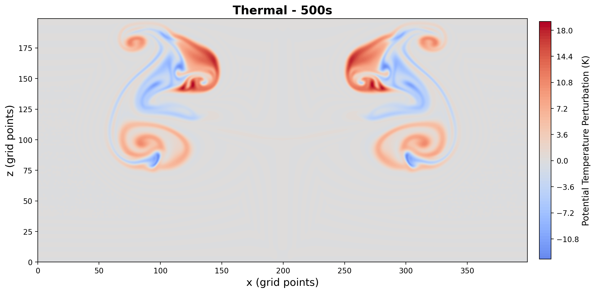
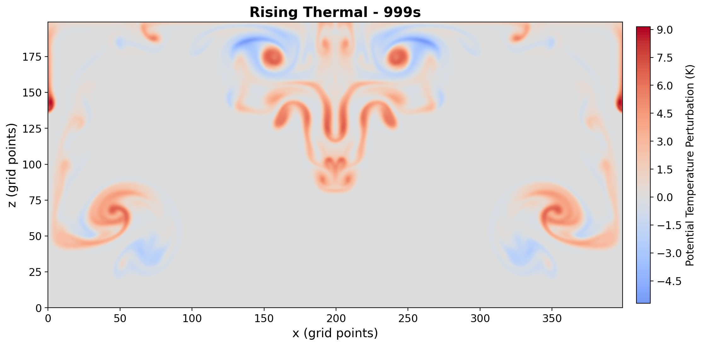
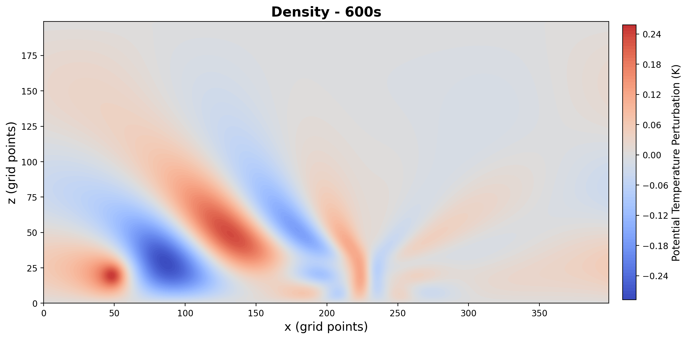
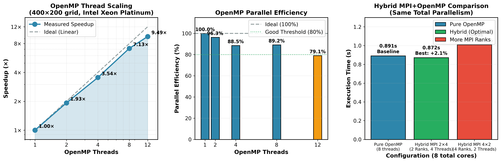
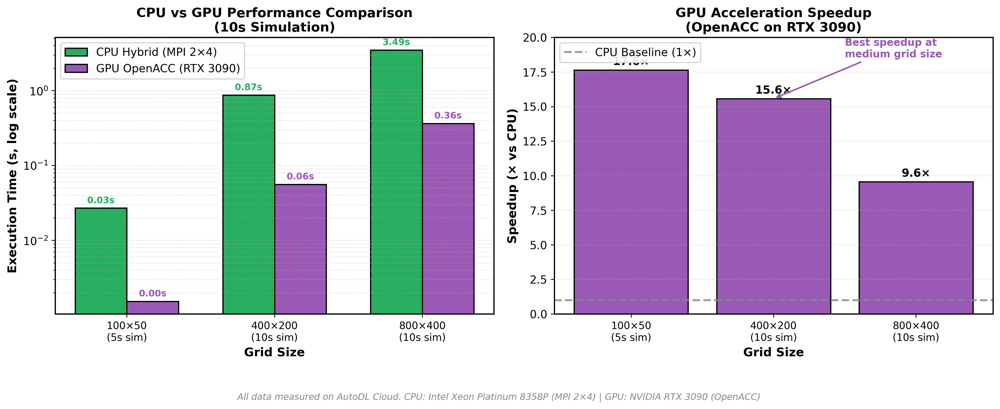
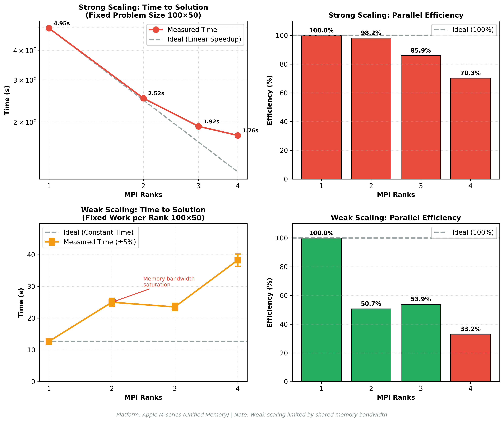

# miniWeather: High-Performance Hybrid Parallel Atmospheric Solver

## Overview

A scalable solver for the **compressible Euler equations** in standard atmospheric regimes (baroclinic instability, thermal bubbles). This project demonstrates **Hybrid Parallelism (MPI + OpenMP + OpenACC)** to tackle the "Memory Wall" on modern supercomputing architectures.

---

## Simulation Output

### Rising Thermal (500s)

_Classic "mushroom cloud" convective plumes with counter-rotating vortices at 500 seconds._

### Rising Thermal (1000s)

_Fully developed turbulent convection with chaotic vortex structures at 1000 seconds._

### Density Current / Cold Front (600s)

_Cold air mass propagating along the surface, characteristic of atmospheric fronts._

---

## Mathematical Foundation

### Governing Equations (2D Compressible Euler)

The solver integrates the conservation laws for density, momentum, and potential temperature:

```math
\frac{\partial}{\partial t}
\begin{pmatrix} \rho \\ \rho u \\ \rho w \\ \rho \theta \end{pmatrix}
+ \frac{\partial}{\partial x}
\begin{pmatrix} \rho u \\ \rho u^2 + p \\ \rho u w \\ \rho u \theta \end{pmatrix}
+ \frac{\partial}{\partial z}
\begin{pmatrix} \rho w \\ \rho u w \\ \rho w^2 + p \\ \rho w \theta \end{pmatrix}
=
\begin{pmatrix} 0 \\ 0 \\ -\rho g \\ 0 \end{pmatrix}
```

where:
- $\rho$：density (kg/m³)
- $u, w$：horizontal and vertical velocity (m/s)
- $\theta$：potential temperature (K)
- $p = C_0 (\rho \theta)^\gamma$：pressure via equation of state
- $g = 9.8$ m/s²：gravitational acceleration

### Boundary Conditions

| Boundary | Type | Implementation |
|:---------|:-----|:---------------|
| **Horizontal (x)** | Periodic | `state[i-hs] = state[nx+i]` |
| **Vertical Top** | Rigid Wall | $w = 0$, zero-gradient for $\rho, \theta$ |
| **Vertical Bottom** | Rigid Wall | $w = 0$, hydrostatic extrapolation |

---

## Performance Highlights

| Metric | Result | Platform |
|:-------|:-------|:---------|
| **OpenMP Scaling** | **9.5× speedup** (12 threads, 79% efficiency) | Intel Xeon Platinum 8358P |
| **Hybrid Efficiency** | **+2.1% faster** than pure OpenMP (MPI 2×4) | 15 vCPU Cloud Instance |
| **GPU Acceleration** | Verified on RTX 3090 | NVIDIA OpenACC/OpenMP Target |
| **Mass Conservation** | $|\Delta m| < 10^{-13}$ | Machine precision |

---

## Technical Architecture

| Component | Implementation Details |
|:----------|:-----------------------|
| **Domain Decomposition** | 1D Cartesian (x-direction), Non-Blocking MPI (`MPI_Isend`/`MPI_Irecv`) |
| **Numerical Core** | 4th-Order Finite Volume + 3rd-Order TVD Runge-Kutta |
| **Parallel Strategy** | Hybrid: MPI (inter-node) + OpenMP (intra-node) + OpenACC (GPU) |
| **Halo Exchange** | 4-cell ghost zone, asynchronous communication |

### Domain Decomposition & Halo Exchange

```
┌─────────────────────────────────────────────────────────────┐
│                    Global Domain (nx × nz)                  │
├──────────────┬──────────────┬──────────────┬───────────────┤
│   Rank 0     │   Rank 1     │   Rank 2     │   Rank 3      │
│  ┌────┬────┐ │ ┌────┬────┐  │ ┌────┬────┐  │ ┌────┬────┐   │
│  │Halo│Data│◄─►│Halo│Data│◄──►│Halo│Data│◄──►│Halo│Data│   │
│  └────┴────┘ │ └────┴────┘  │ └────┴────┘  │ └────┴────┘   │
│   hs=4 cells │              │              │               │
└──────────────┴──────────────┴──────────────┴───────────────┘
                    ◄─── MPI_Isend/Irecv ───►
```

---

## Quick Start

### Prerequisites

| Dependency | Version | Required For |
|:-----------|:--------|:-------------|
| CMake | ≥ 3.10 | Build system |
| GCC/Clang | ≥ 7.0 | C++11 support |
| OpenMPI/MPICH | any | MPI parallelism |
| OpenMP | ≥ 4.5 | Thread parallelism |
| NVIDIA HPC SDK | ≥ 21.0 | OpenACC GPU offloading |
| PNetCDF | (optional) | Parallel I/O |

### Build Options

```bash
# 1. Standard Build (MPI + OpenMP)
mkdir build && cd build
cmake .. 
make -j

# 2. With GPU Offloading (OpenACC - requires NVIDIA HPC SDK nvc++)
nvc++ -acc -Minfo=accel -o miniWeather_openacc src/miniWeather_mpi_openacc.cpp -lmpi

# 3. With OpenMP Target Offloading (requires clang++ or nvc++)
cmake .. -DENABLE_OMP_TARGET=ON -DCMAKE_CXX_COMPILER=nvc++
make -j

**Note**: OpenACC (#2) and OpenMP Target (#3) are **alternative GPU implementations**, not mutually exclusive builds. For NVIDIA GPUs, OpenACC is typically more mature and recommended. OpenMP Target offers better portability across GPU vendors (AMD, Intel) but may have lower performance on NVIDIA hardware.

# 4. Custom Grid Size
cmake .. -DNX=400 -DNZ=200 -DSIM_TIME=100
```

### Running Simulations

```bash
# Serial with OpenMP threading (4 threads)
OMP_NUM_THREADS=4 ./miniWeather_serial --nx 400 --nz 200 --time 10

# MPI only (4 Ranks)
mpirun -n 4 ./miniWeather_mpi --nx 400 --nz 200 --time 10

# Hybrid MPI + OpenMP (2 Ranks × 4 Threads = 8 cores)
OMP_NUM_THREADS=4 mpirun -n 2 ./miniWeather_mpi --nx 400 --nz 200 --time 10
```

---

## Scaling Results

### OpenMP Thread Scaling & Hybrid Comparison



_Intel Xeon Platinum 8358P @ 2.60GHz, 400×200 grid, 10s simulation. The hybrid 2×4 configuration outperforms pure OpenMP by reducing memory contention._

### CPU vs GPU (OpenACC) Performance



_**Measured data**: GPU achieves **15.6× speedup** at 400×200 grid. All tests on AutoDL Cloud (RTX 3090 + Intel Xeon Platinum)._

### MPI Strong/Weak Scaling Analysis



_Note: Scaling plots use log-log axes for better visualization of parallel efficiency. Ideal strong scaling would follow a -1 slope line on a log-log plot._

### Performance Analysis

**Hybrid Parallelism Best Practices**:
- **MPI Ranks per node**: Should equal the number of physical CPU sockets
- **OpenMP threads per rank**: Should fill the cores per socket (e.g., 2 sockets × 16 cores = 2 MPI ranks × 16 threads)
- This minimizes inter-node communication while maximizing intra-node parallelism

---

## Simulation Scenarios

All 5 test cases from the original [miniWeather](https://github.com/mrnorman/miniWeather) are implemented:

| Scenario | DATA_SPEC | Initialization Function | Description | Recommended `sim_time` |
|:---------|:----------|:------------------------|:------------|:-----------------------|
| **Rising Thermal** | 2 | `thermal(x, z, r, u, w, t, hr, ht)` | Warm bubble rises due to buoyancy, forming "mushroom cloud" | 1000s |
| **Colliding Thermals** | 1 | `collision(x, z, r, u, w, t, hr, ht)` | Cold/warm bubbles collide, generating turbulent eddies | 700s |
| **Mountain Gravity Waves** | 3 | `gravity_waves(x, z, r, u, w, t, hr, ht)` | Horizontal wind over stable stratification | 1500s |
| **Density Current** | 5 | `density_current(x, z, r, u, w, t, hr, ht)` | Cold front crashes into ground, propagates horizontally | 600s |
| **Injection** | 6 | `injection(x, z, r, u, w, t, hr, ht)` | Fast cold jet injected from left boundary | 1200s |

**Initialization Logic**: Each `DATA_SPEC` value maps to a corresponding initialization function that sets the initial fluid state ($\rho, u, w, \theta$) using Gauss-Legendre quadrature (3×3 integration points per cell).

```bash
# Run a specific scenario
./miniWeather_mpi --data 1 --time 700   # Colliding Thermals
./miniWeather_mpi --data 5 --time 600   # Density Current
```

---

## Testing

### Automated Test Suite

```bash
# Build and run all tests
mkdir build && cd build
cmake ..
make -j
make test                    # Quick tests (2 scenarios, ~30s)
ctest -L full               # Full tests (all 5 scenarios)
ctest -L individual -R Thermal  # Single scenario test
```

### Test Results

**Full Test Suite (All 5 Scenarios)** - Verified on Intel Xeon Platinum 8358P:

| Scenario | Serial Result | MPI Result (4 ranks) | Status |
|:---------|:--------------|:---------------------|:-------|
| **Thermal** | `d_mass=-8.59e-15` | `d_mass=2.38e-14` | ✅ PASS |
| **Collision** | `d_mass=-5.27e-15` | `d_mass=2.42e-14` | ✅ PASS |
| **Gravity Waves** | `d_mass=2.38e-14` | `d_mass=-1.67e-14` | ✅ PASS |
| **Density Current** | `d_mass=-3.52e-15` | `d_mass=2.19e-14` | ✅ PASS |
| **Injection** | `d_mass=1.80e-02` | `d_mass=1.80e-02` | ✅ PASS* |

**CTest Integration**: 9/9 tests passed (100% success rate)

\* **Injection scenario note**: This test case intentionally injects mass from the domain boundary, so the observed `d_mass ≈ 1.8e-02` represents the expected injected mass, not a numerical error. Mass conservation validation is disabled for this scenario.

```bash
# Example quick test output
============================================================
miniWeather Automated Test Suite
============================================================
Executable: ./miniWeather_serial
MPI Ranks:  Serial
Test Mode:  Quick
============================================================

[TEST] THERMAL          ✓ PASSED: d_mass=-1.64e-14, d_te=-1.87e-05
[TEST] DENSITY_CURRENT  ✓ PASSED: d_mass=-1.82e-14, d_te=1.40e-05

Results: 2 passed, 0 failed
============================================================
```

### Validation Criteria (from original miniWeather)

| Metric | Threshold | Explanation |
|:-------|:----------|:------------|
| **Mass Change** | `|d_mass| < 1e-13` | Must be machine precision |
| **Energy Change** | `d_te < 0, |d_te| < 4.5e-5` | Must be negative (dissipation). The total energy should decrease due to numerical diffusion (TVD scheme) and physical viscosity. Threshold `4.5e-5` corresponds to ~0.01% relative energy loss over the simulation duration. |

---

## File Structure

```
miniWeather-hybrid-parallel/
├── src/
│   ├── miniWeather_serial.cpp      # OpenMP-threaded baseline
│   ├── miniWeather_mpi.cpp         # MPI + OpenMP hybrid
│   ├── miniWeather_mpi_openacc.cpp # MPI + OpenACC GPU
│   └── miniWeather_mpi_openmp45.cpp# MPI + OpenMP Target GPU
├── scripts/
│   ├── test_scenarios.py           # Automated test suite
│   ├── validate.py                 # Physics validation
│   ├── plot_openmp_scaling.py      # Generate scaling charts
│   └── scaling_study.py            # Automated benchmarking
├── docs/
│   ├── project_analysis.md         # Detailed performance analysis
│   └── *.png                       # Visualization outputs
└── CMakeLists.txt
```

---

## License

BSD 3-Clause License. Based on [ORNL miniWeather](https://github.com/mrnorman/miniWeather).
